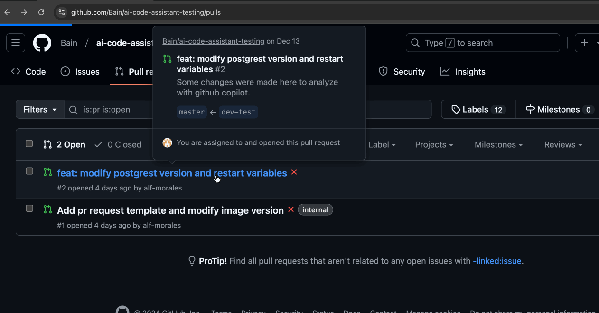
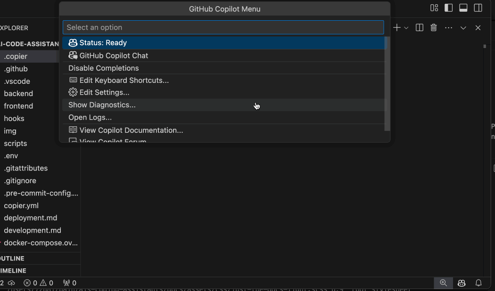
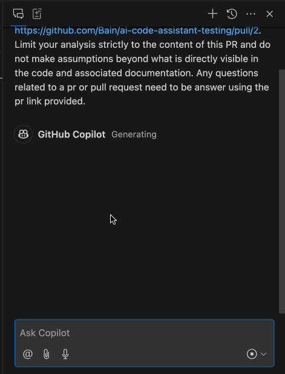
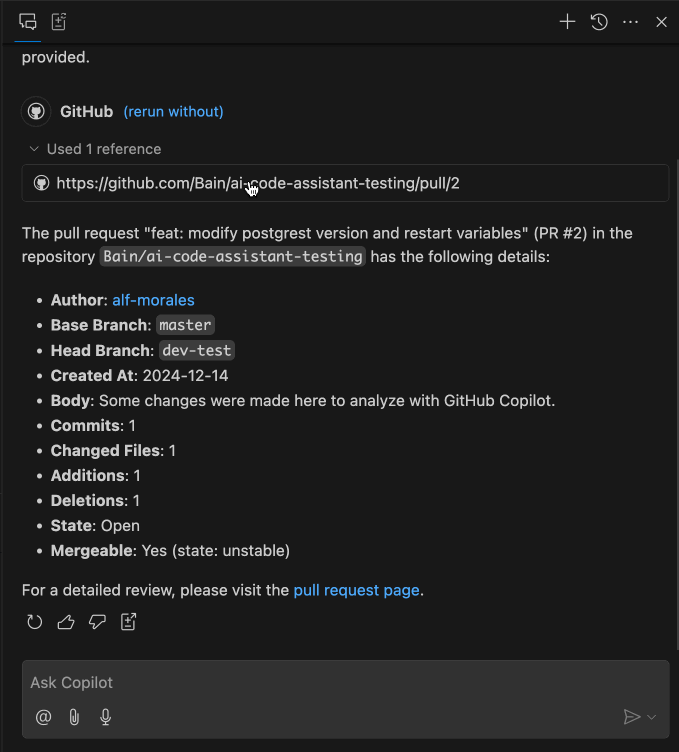

# Automatic Pull Request Review

## Introduction

This guide provides instructions for using GitHub Copilot as an assistant for reviewing pull requests (PRs). Although GitHub currently does not support using Copilot directly as a reviewer on a PR, there is a practical workaround: you can use the GitHub Copilot extension in Visual Studio Code. This approach allows you to leverage Copilot’s insights to analyze and summarize PR changes, identify potential issues, and suggest improvements.

**Note**: GitHub plans to support adding GitHub Copilot as a reviewer directly through the GitHub UI in the future. Once this feature becomes generally available (GA), we will update this guide accordingly to include instructions for using it natively.

## Instructions

### Overview

Since we cannot directly integrate Copilot as a reviewer on GitHub’s PR interface, we will use the GitHub Copilot Chat extension in Visual Studio Code to review and interact with the PR. By doing so, we can prompt Copilot to answer questions, highlight potential issues, and help improve the code under review.

### Steps

1. **Create a Pull Request on GitHub**  
   Begin by creating a pull request on GitHub. Once your PR is open and ready for review, copy its URL.
   

2. **Open GitHub Copilot Chat in VS Code**  
   Launch Visual Studio Code and open the GitHub Copilot Chat extension.
   

3. **Provide a Well-Structured Initial Prompt**  
   To keep Copilot focused, start with an initial prompt that includes the PR link and clear instructions. For example:  
   > Please review the pull request found at [Link to your PR]. Limit your analysis strictly to the content of this PR and do not make assumptions beyond what is directly visible in the code and associated documentation. Any questions related to a pr or pull request need to be answer using the pr link provided.

   


4. **Verify the Reference**  
   Copilot should now be referencing the correct PR. You can confirm this by observing the Copilot Chat responses. When Copilot uses the linked PR for context, you’ll see the GitHub logo in the assistant's response and a reference to your PR link. Expanding the "user referenced" section (if available) can also help verify that Copilot is analyzing the correct PR.  
   


## How Can We Use the Assistant?

The Copilot assistant can be helpful in various review scenarios:

- **Extensive Code Changes:**  
When faced with a large PR, you can ask Copilot to summarize complex changes, highlight new features, or identify potentially problematic sections of code.

- **Security and Vulnerability Checks:**  
Ask Copilot to look for potential security vulnerabilities or suspicious code patterns, making it easier to ensure that the changes are secure.

- **Comparing Old and New Implementations:**  
If a refactoring took place, you can instruct Copilot to compare the old implementation (`oldFunction()`) with the new one (`newFunction()`), highlighting differences and improvements.

- **Bug and Logic Checks:**  
Request that Copilot identify logical errors, possible bugs, or areas where the code could fail under certain conditions.

- **Refactoring Suggestions:**  
Prompt Copilot for potential improvements or refactoring opportunities and ask for explanations of why these suggestions would be beneficial.

Some example prompts include:

- *"Summarize the changes made in this PR and their purpose."*  
- *"Highlight potential security vulnerabilities introduced in this diff."*  
- *"Compare the logic in `oldFunction()` with the new approach in `newFunction()`."*  
- *"Check for potential bugs, security issues, or logical errors."*  
- *"Suggest improvements or refactoring opportunities and explain why they would be beneficial."*  
- *"Provide an overall assessment of how well these changes address the intended goals of the PR."*

Additionally, you can ask Copilot to explain code, discuss how to improve maintainability, or suggest performance optimizations.

## Reviewing a Large PR

When dealing with a large PR or significant changes, it might be more efficient to work locally:

1. **Pull the PR Branch Locally**  
Fetch and check out the PR branch on your local machine using the following commands:
```
git fetch origin pull/<PR_NUMBER>/head:pr-branch
git checkout pr-branch
```
Replace <PR_NUMBER> with the actual number of the pull request. This command creates and switches to a new local branch (pr-branch) that reflects the PR’s state.

2. **Open GitHub Copilot Chat**: With the PR’s changes present locally, open GitHub Copilot Chat in VS Code. Because your local code now matches the PR, Copilot can analyze the differences directly.

3. **Ask Targeted Questions**: Break down your inquiries into smaller, more focused prompts:

    - *"Summarize the main functionality added or changed in this PR."*
    - *"Identify code segments that might introduce performance regressions or scalability issues."*
    - *"Check for potential library usage introduced and explain its purpose."*
    - *"Highlight any significant logic changes between oldFunction() and newFunction()."*

    Targeted questions help Copilot focus on what matters most, making it easier to digest the output.  

4. **Iterate and Dive Deeper**: If Copilot flags a concern, follow up with more detailed questions:

    - *"Explain why the identified code segment might degrade performance and suggest alternatives."*
    - *"Which parts of the code handle user input, and how can we ensure robust validation?"*
   
   Continue to fine-tune your prompts if Copilot’s responses become less relevant:
   > Please re-check this logic against the PR files only. Avoid referencing code outside the given PR.


5. **Integrate Results into Your Review Process**: Use Copilot’s suggestions and analyses as a starting point. Combine them with your own expertise, testing, and additional tools to form a comprehensive review.

***Benefits of This Approach***

By reviewing large PRs locally and using Copilot:

- **Improved Productivity**:
Quickly identify key changes and problematic areas without manually sifting through the entire diff.

- **Increased Confidence**:
Leverage Copilot’s trained insights to catch subtle issues and improve the overall quality of your review.

- **More Informed Decision-Making**:
Gain a clearer understanding of the changes and how they align with project goals and quality standards.


**Ensuring PR-Only Focus in Follow-Up Prompts**  
If Copilot starts to incorporate external assumptions or non-PR-related knowledge, gently guide it back to focus on the current PR. For instance:

> You’re drifting beyond the scope of the provided PR. Please limit your analysis strictly to the changes visible in the link I provided. Do not use any external code or documentation not present in the PR.

These repeated reminders act as a fine-tuning mechanism in real-time, helping Copilot maintain its focus.

Sometimes it will be necessary to restart all progress made and start a new chat from zero. If Copilot continues drifting or starts [hallucinating](https://www.ibm.com/think/topics/ai-hallucinations), a good approach would be to use a larger prompt referring to the PR link and asking the questions in the same prompt:

> Please review the pull request found at [Link to your PR]. Limit your analysis strictly to the content of this PR and do not make assumptions beyond what is directly visible in the code and associated documentation. Any questions related to a PR or pull request need to be answered using the PR link provided. Analyze all the code, look for potential security vulnerabilities, check for potential bugs, suggest improvements, etc.

*If the initial strategy of incorporating the PR and general instructions in the first prompt proves ineffective, consider this expanded approach as a reliable backup plan. By restarting the session and providing comprehensive context within a single, detailed prompt, you can help ensure Copilot remains tightly focused on the specific PR under review.*